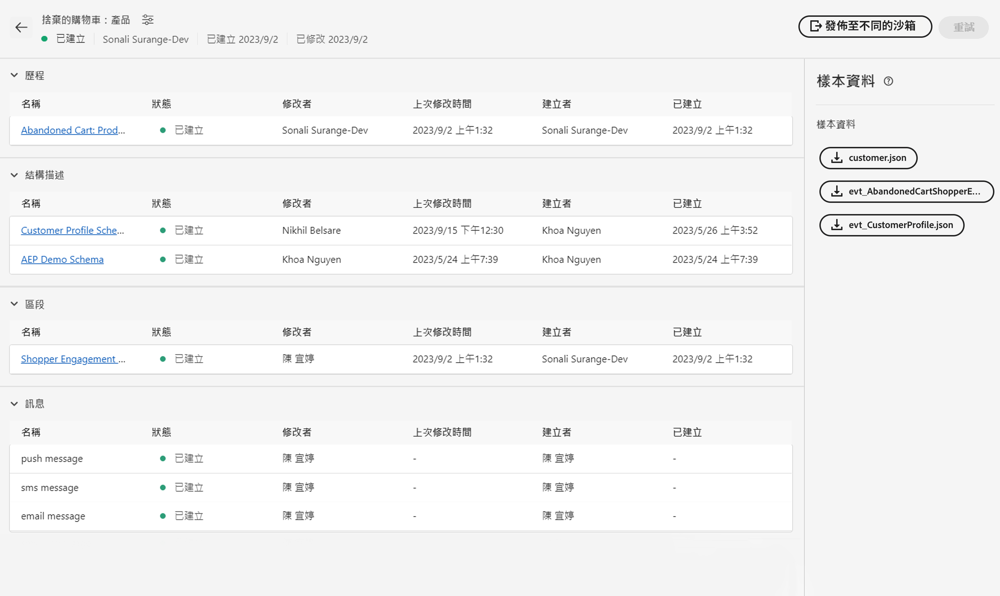

# 單一事件

## 要遵循的步驟 {#steps-to-follow}

>[!CONTEXTUALHELP]
>id="marketerexp_sampledata_unitaryevent"
>title="如何使用？"
>abstract="如需詳細資訊，請依照連結"

>[!IMPORTANT]
>
>這些指示可能會隨以下專案而變更： **[!UICONTROL 教戰手冊]** 因此，請一律參閱個別的「範例資料」區段 **[!UICONTROL 教戰手冊]**.

## 先決條件

* 您必須安裝Postman軟體
* 使用Playbook建立例項資產，如 **[!UICONTROL 歷程]**， **[!UICONTROL 方案]**， **[!UICONTROL 區段]**， **[!UICONTROL 訊息]** 等等。

建立的資產將顯示在 `Bill Of Material` 頁面



## 使用必要的集合準備Postman

1. 造訪 **[!UICONTROL 使用案例行動手冊]** 應用程式。
1. 按一下個別的 **[!UICONTROL 教戰手冊]** 要造訪的卡片 **[!UICONTROL 教戰手冊]** 詳細資訊頁面。
1. 造訪 **[!UICONTROL 用料表]** 頁面並找到 **[!UICONTROL 範例資料]** 區段。
1. 下載 `postman.json` 按一下UI上的個別按鈕。
1. 匯入 `postman.json` 在 **[!DNL Postman Software]**.
1. 為此驗證建立專用的Postman環境(例如 `Adobe <PLAYBOOK_NAME>`)。

## 擷取IMS權杖

>[!NOTE]
>
>所有環境變數都會區分大小寫，因此請一律使用正確的變數名稱。

1. 請關注 [驗證及存取Experience PlatformAPI](https://experienceleague.adobe.com/docs/experience-platform/landing/platform-apis/api-authentication.html) 產生存取Token的檔案。
1. 將存取Token值儲存在名為的環境變數中 `ACCESS_TOKEN`.
1. 儲存其他驗證相關的值，例如 `API_KEY`， `IMS_ORG` 和 `SANDBOX_NAME` 環境變數中。

>[!IMPORTANT]
>
>從Postman執行任何API之前，請確定必須新增所有必要的環境變數。

## 發佈Playbook建立的歷程

有2種方式可發佈歷程；您可以選擇任一種：

1. **使用AJO UI**  — 按一下上的歷程連結 `Bill Of Material Page`；這會將您重新導向至您可點按的歷程頁面 **[!UICONTROL 發佈]** 按鈕和歷程將發佈。

   

1. **使用Postman API**

   1. 觸發 **[!DNL Publish Journey]** 請求來源 **[!DNL Journey Publish]** > **[!DNL Queue journey publish job]**.
   1. 歷程發佈可能需要一些時間，所以為了檢查狀態，請執行Check Journey Publish狀態API，直到 `response.status` 是 `SUCCESS`，如果歷程發佈需要時間，請務必等待10至15秒。

   >[!NOTE]
   >
   >所有環境變數都會區分大小寫，因此請一律使用正確的變數名稱。

## 擷取客戶設定檔

>[!TIP]
>
>您可以透過附加來重複使用相同的電子郵件地址 `+<variable>` 放入您的電子郵件中，例如 `usertest@email.com` 可恢復為 `usertest+v1@email.com` 或 `usertest+24jul@email.com`. 如果每次都能有新的設定檔，但仍使用相同的電子郵件ID，這會很有幫助。

1. 首次使用者需要建立 **[!DNL customer dataset]** 和 **[!DNL HTTP Streaming Inlet Connection]**.
1. 如果您已建立 **[!DNL customer dataset]** 和 **[!DNL HTTP Streaming Inlet Connection]**，請跳到步驟 `5`.
1. 觸發 **[!DNL Customer Profile Ingestion]** > **[!DNL Create Customer Profile InletId]** > **[!DNL Create Dataset]** 以建立 **[!DNL customer dataset]**；這將儲存 `CustomerProfile_dataset_id` 在postman環境變數中。
1. 建立 **[!DNL HTTP Streaming Inlet Connection]**，在下使用Postman API **[!DNL Customer Profile Ingestion > Create Customer Profile InletId]**.

   1. `CustomerProfile_dataset_id` postman環境變數中必須可用，否則請參閱步驟 `3`.
   1. 觸發 **[!DNL `CREATE Base Connection`]** 至 [!DNL create base connection].
   1. 觸發 **[!DNL `CREATE Source Connection`]** 至 [!DNL create source connection].
   1. 觸發 **[!DNL `CREATE Target Connection`]** 至 [!DNL create target connection].
   1. 觸發 **[!DNL `CREATE Dataflow`]** 至 [!DNL create dataflow].
   1. 觸發 **[!DNL `GET Base Connection`]** — 這將自動儲存 `CustomerProfile_inlet_id` 在postman環境變數中。

1. 在此步驟中，您必須擁有 `CustomerProfile_dataset_id` 和 `CustomerProfile_inlet_id` 在postman環境變數中；如果沒有，請參考步驟 `3` 或 `4` （分別）。
1. 若要內嵌客戶，使用者需要儲存 `customer_country_code`， `customer_mobile_no`， `customer_first_name`， `customer_last_name` 和 `email` 在postman環境變數中。

   1. `customer_country_code` 將是行動電話號碼的國家代碼，例如 `91` 或 `1`
   1. `customer_mobile_no` 可能是行動電話號碼，例如 `9987654321`
   1. `customer_first_name` 會是使用者的名字
   1. `customer_last_name` 將會是使用者的姓氏
   1. `email` 會是使用者的電子郵件地址，這對於使用不同的電子郵件id以便擷取新的設定檔至關重要。

1. 更新Postman請求 **[!DNL Customer Ingestion]** > **[!DNL Customer Streaming Ingestion]** 以變更客戶的偏好管道；根據預設 [!DNL `email`] 已在要求中設定。

   ```js
   "consents": {
       "marketing": {
           "preferred": "email",
           "email": {
               "val": "y"
           },
           "push": {
               "val": "n"
           },
           "sms": {
               "val": "n"
           }
       }
   }
   ```

1. 將偏好的管道變更為 `sms` 或 `push` 並將個別管道值設為 `y` 和 `n` 至其他值，例如

   ```js
   "consents": {
       "marketing": {
           "preferred": "sms",
           "email": {
               "val": "n"
           },
           "push": {
               "val": "n"
           },
           "sms": {
               "val": "y"
           }
       }
   }
   ```

1. 最後觸發 **[!DNL `Customer Profile Ingestion > Customer Profile Streaming Ingestion`]** 以內嵌客戶設定檔。

## 擷取事件

1. 第一次使用者需要建立 **[!DNL event dataset]** 和 **[!DNL HTTP Streaming Inlet Connection for events]**
1. 如果您已建立 **[!DNL event dataset]** 和 **[!DNL HTTP Streaming Inlet Connection for events]**，請跳到步驟 `5`.
1. 觸發 **[!DNL `Schemas Data Ingestion > AEP Demo Schema Ingestion > Create AEP Demo Schema InletId > Create Dataset`]** 以建立 **[!DNL event dataset]**，這將會儲存 `AEPDemoSchema_dataset_id` 在郵遞員環境變數中
1. 建立 **[!DNL HTTP Streaming Inlet Connection for events]**，在下使用Postman API **[!DNL Schemas Data Ingestion]** > **[!DNL AEP Demo Schema Ingestion]** > **[!DNL Create AEP Demo Schema InletId]**.

   1. `AEPDemoSchema_dataset_id` postman環境變數中必須可用，否則請參閱步驟 `3`
   1. 觸發 **[!DNL `CREATE Base Connection`]** 至 [!DNL create base connection]
   1. 觸發 **[!DNL `CREATE Source Connection`]** 至 [!DNL create source connection]
   1. 觸發 **[!DNL `CREATE Target Connection`]** 至 [!DNL create target connection]
   1. 觸發 **[!DNL `CREATE Dataflow`]** 至 [!DNL create dataflow]
   1. 觸發 **[!DNL `GET Base Connection`]** — 這將自動儲存 `AEPDemoSchema_inlet_id` 在postman環境變數中

1. 在此步驟中，您必須擁有 `AEPDemoSchema_dataset_id` 和 `AEPDemoSchema_inlet_id` 在postman環境變數中，如果沒有，請參閱步驟 `3` 或 `4` 分別為
1. 若要內嵌事件，使用者需要變更時間變數 `timestamp` 請求內文 **[!DNL Schemas Data Ingestion]** > **[!DNL AEP Demo Schema Ingestion]** > **[!DNL AEP Demo Schema Streaming Ingestion]** 郵遞員。

   1. `timestamp` 如果是事件發生時間，則使用目前的時間戳記，例如 `2023-07-21T16:37:52+05:30` 視需要調整時區。

1. 觸發 **[!DNL Schemas Data Ingestion > AEP Demo Schema Ingestion > AEP Demo Schema Streaming Ingestion]** 擷取事件，以便觸發歷程

## 最終驗證

您必須在中選取的偏好頻道上收到訊息 **[!DNL Ingest the Customer Profile]** 步驟 `8`

* `SMS` 如果偏好管道為 `sms` 於 `customer_country_code` 和 `customer_mobile_no`
* `Email` 如果偏好管道為 `email` 於 `email`

或者，您可以檢查 `Journey Report`，若要檢視，請按一下 `Journey Object` 於 `Bill of Materials page` 這會將您重新導向 `Journey Details page`.

對於任何已發佈的歷程使用者，必須取得 **[!UICONTROL 檢視報告]** 按鈕


## 清除

沒有多個例項 `Journey` 如果歷程僅於驗證完成後用於驗證，請停止該歷程。
