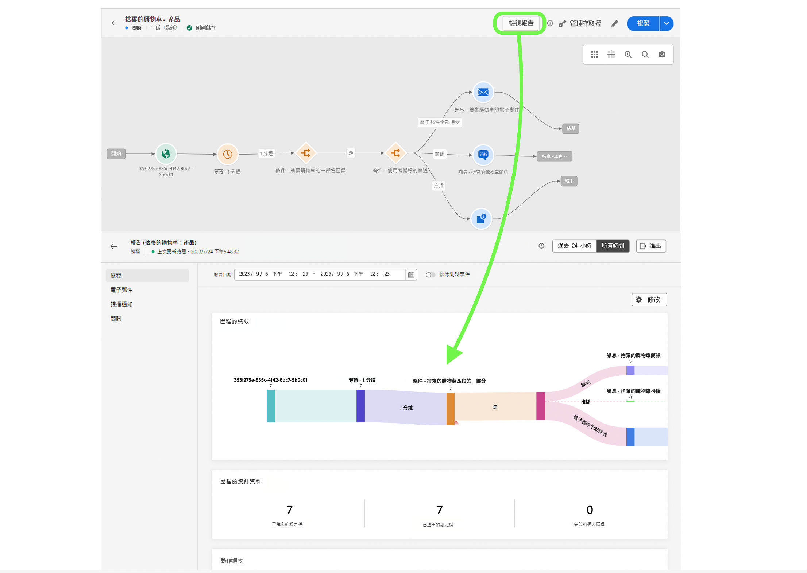

# 單一事件

## 需要進行的步驟 {#steps-to-follow}

>[!CONTEXTUALHELP]
>id="marketerexp_sampledata_unitaryevent"
>title="如何使用？"
>abstract="請依照連結了解更多詳情"

>[!IMPORTANT]
>
>**[!UICONTROL 教戰手冊]**&#x200B;這些說明可能會有變動，因此，請隨時參考個別&#x200B;**[!UICONTROL 教戰手冊]**&#x200B;的「範例」資料部份。

## 先決條件

* 使用教戰手冊並建立實例資產，例如&#x200B;**[!UICONTROL 歷程]**、**[!UICONTROL 結構描述]**、**[!UICONTROL 區段]**、**[!UICONTROL 訊息]**&#x200B;等。

* 已建立的資產將顯示在`Bill Of Material`頁面

<!-- TODO: attached image needs to change once postman is removed from UI -->


>[!TIP]
>
>如果您使用終端機執行 curl，則可以在執行 curl 之前設定變數值，這樣就無需在各個 curl 中替換這些值。
>例如：如果您設定 `ORG_ID=************@AdobeOrg`，shell 會自動將每次出現的 `$ORG_ID` 替換成該值，這樣您就可以複製、貼上和執行以下 curl 而不用做任何修改。
>
> 本文件中使用了以下變數
>
> ACCESS_TOKEN
>
> API_KEY
>
> ORG_ID
>
> SANDBOX_NAME
>
> PROFILE_SCHEMA_REF
>
> PROFILE_DATASET_NAME
>
> PROFILE_DATASET_ID
>
> JOURNEY_ID
>
> PROFILE_BASE_CONNECTION_ID
>
> PROFILE_SOURCE_CONNECTION_ID
>
> PROFILE_TARGET_CONNECTION_ID
>
> PROFILE_INLET_URL
>
> CUSTOMER_MOBILE_NUMBER
>
> CUSTOMER_FIRST_NAME
>
> CUSTOMER_LAST_NAME
>
> EMAIL
>
> EVENT_SCHEMA_REF
>
> EVENT_DATASET_NAME
>
> EVENT_DATASET_ID
>
> EVENT_BASE_CONNECTION_ID
>
> EVENT_SOURCE_CONNECTION_ID
>
> EVENT_TARGET_CONNECTION_ID
>
> EVENT_INLET_URL
>
> TIMESTAMP
>
> UNIQUE_EVENT_ID

## 擷取 IMS 權杖

1. 請依照[驗證和存取 Experience Platform API](https://experienceleague.adobe.com/docs/experience-platform/landing/platform-apis/api-authentication.html?lang=zh-Hant) 文件來產生存取權杖。

## 發佈教戰手冊建立的歷程

發佈歷程有 2 種方式；您可以選擇其中一種：

1. **使用 AJO UI**- `Bill Of Material Page`上，按一下歷程連結；這會將您重新導向歷程頁面，您可以在該頁面按一下「**[!UICONTROL 發佈]**」按鈕即可發佈歷程。

   

1. **使用 cURL**

   1. 發佈歷程。回應將包含在下一步驟中擷取歷程發佈狀態所需的作業 ID。

      ```bash
      curl --location --request POST "https://journey-private.adobe.io/authoring/jobs/journeyVersions/$JOURNEY_ID/deploy" \
      --header "Accept: */*" \
      --header "Authorization: Bearer $ACCESS_TOKEN" \
      --header "x-api-key: $API_KEY" \
      --header "x-gw-ims-org-id: $ORG_ID" \
      --header "x-sandbox-name: $SANDBOX_NAME" \
      --header "Content-Type: application/json" 
      ```

   1. 歷程發佈可能需要一些時間，因此若為了檢查狀態，請執行以下 cURL，直到 `response.status` 是 `SUCCESS` 為止；如果歷程發佈需要時間，請確保等待 10-15 秒。

      ```bash
      curl --location "https://journey-private.adobe.io/authoring/jobs/$JOB_ID" \
      --header "Authorization: Bearer $ACCESS_TOKEN" \
      --header "x-api-key: $API_KEY" \
      --header "x-gw-ims-org-id: $ORG_ID" \
      --header "x-sandbox-name: $SANDBOX_NAME" \
      --header "Content-Type: application/json"
      ```

## 擷取客戶設定檔

>[!TIP]
>
>如果您的電子郵件提供者支援 Plus 電子郵件，您可以將 `+<variable>` 附加到電子郵件，藉此重複使用相同的電子郵件地址，例如 `usertest@email.com` 可以作為 `usertest+v1@email.com` 或 `usertest+24jul@email.com` 重複使用。這樣可在每次有新的設定檔時，仍然使用相同的電子郵件 ID。
>
>備註：Plus 電子郵件是一項可設定功能，需要電子郵件提供者支援。在測試中使用這些地址之前，請檢查您是否可以收到這些地址的電子郵件。

1. 首次使用的使用者需要建立 **[!DNL customer dataset]** 和 **[!DNL HTTP Streaming Inlet Connection]**。
1. 如果您已經建立 **[!DNL customer dataset]** 和 **[!DNL HTTP Streaming Inlet Connection]**，請跳至步驟 `5`。
1. 透過執行以下 cURL 建立客戶設定檔資料集。

   ```bash
   curl --location "https://platform.adobe.io/data/foundation/catalog/dataSet" \
   --header "Authorization: Bearer $ACCESS_TOKEN" \
   --header "x-gw-ims-org-id: $ORG_ID" \
   --header "x-sandbox-name: $SANDBOX_NAME" \
   --header "x-api-key: $API_KEY" \
   --header "Content-Type: application/json" \
   --data '{
       "name": "'$PROFILE_DATASET_NAME'",
       "schemaRef": {
           "id": "'$PROFILE_SCHEMA_REF'",
           "contentType": "application/vnd.adobe.xed-full-notext+json; version=1"
       },
       "tags": {
           "unifiedProfile": [
           "enabled:true"
           ],
           "unifiedIdentity": [
           "enabled:true"
           ]
       },
       "fileDescription": {
           "persisted": true,
           "containerFormat": "parquet",
           "format": "parquet"
       }
   }'
   ```

   回應的格式為 `"@/dataSets/<PROFILE_DATASET_ID>"`。

1. 藉助以下步驟建立 **[!DNL HTTP Streaming Inlet Connection]**。
   1. 建立基本連線。

      ```bash
      curl --location "https://platform.adobe.io/data/foundation/flowservice/connections?Cache-Control=no-cache" \
      --header "Authorization: Bearer $ACCESS_TOKEN" \
      --header "x-gw-ims-org-id: $ORG_ID" \
      --header "x-sandbox-name: $SANDBOX_NAME" \
      --header "x-api-key: $API_KEY" \
      --header "Content-Type: application/json" \
      --data '{
          "name": "AbandonedCartProduct_Base_ConnectionForCustomerProfile_1694458293",
          "description": "Marketer Playground Playbook-Validation Customer Profile Base Connection 1",
          "auth": {
              "specName": "Streaming Connection",
              "params": {
                  "dataType": "xdm"
              }
          },
          "connectionSpec": {
              "id": "bc7b00d6-623a-4dfc-9fdb-f1240aeadaeb",
              "version": "1.0"
          }
      }'
      ```

      從回應中取得基本連線 ID 並使用它取代以下 cURL 中的 `PROFILE_BASE_CONNECTION_ID`

   1. 建立來源連線。

      ```bash
      curl --location "https://platform.adobe.io/data/foundation/flowservice/sourceConnections" \
      --header "Authorization: Bearer $ACCESS_TOKEN" \
      --header "x-gw-ims-org-id: $ORG_ID" \
      --header "x-sandbox-name: $SANDBOX_NAME" \
      --header "Content-Type: application/json" \
      --header "x-api-key: $API_KEY" \
      --data '{
          "name": "AbandonedCartProduct_Source_ConnectionForCustomerProfile_1694458318",
          "description": "Marketer Playground Playbook-Validation Customer Profile Source Connection 1",
          "baseConnectionId": "'$PROFILE_BASE_CONNECTION_ID'",
          "connectionSpec": {
              "id": "bc7b00d6-623a-4dfc-9fdb-f1240aeadaeb",
              "version": "1.0"
          }
      }'
      ```

      從回應中取得來源連線 ID 並使用它取代 `PROFILE_SOURCE_CONNECTION_ID`

   1. 建立目標連線。

      ```bash
      curl --location "https://platform.adobe.io/data/foundation/flowservice/targetConnections" \
      --header "Authorization: Bearer $ACCESS_TOKEN" \
      --header "x-gw-ims-org-id: $ORG_ID" \
      --header "x-sandbox-name: $SANDBOX_NAME" \
      --header "Content-Type: application/json" \
      --header "x-api-key: $API_KEY" \
      --data '{
          "name": "AbandonedCartProduct_Target_ConnectionForCustomerProfile_1694458407",
          "description": "Marketer Playground Playbook-Validation Customer Profile Target Connection 1",
          "data": {
              "format": "parquet_xdm",
              "schema": {
                  "version": "application/vnd.adobe.xed-full+json;version=1",
                  "id": "'$PROFILE_SCHEMA_REF'"
              },
              "properties": null
          },
          "connectionSpec": {
              "id": "c604ff05-7f1a-43c0-8e18-33bf874cb11c",
              "version": "1.0"
          },
          "params": {
              "dataSetId": "'$PROFILE_DATASET_ID'"
          }
      }'
      ```

      從回應中取得目標連線 ID 並使用它取代 `PROFILE_TARGET_CONNECTION_ID`

   1. 建立資料流。

      ```bash
      curl --location "https://platform.adobe.io/data/foundation/flowservice/flows" \
      --header "Authorization: Bearer $ACCESS_TOKEN" \
      --header "x-gw-ims-org-id: $ORG_ID" \
      --header "x-sandbox-name: $SANDBOX_NAME" \
      --header "Content-Type: application/json" \
      --header "x-api-key: $API_KEY" \
      --data '{
          "name": "AbandonedCartProduct_Dataflow_ForCustomerCustomerProfile_1694460528",
          "description": "Marketer Playground Playbook-Validation Customer Profile Dataflow 1",
          "flowSpec": {
              "id": "d8a6f005-7eaf-4153-983e-e8574508b877",
              "version": "1.0"
          },
          "sourceConnectionIds": [
              "'$PROFILE_SOURCE_CONNECTION_ID'"
          ],
          "targetConnectionIds": [
              "'$PROFILE_TARGET_CONNECTION_ID'"
          ]
      }'
      ```

   1. 取得基本連線。結果將包含傳送設定檔資料所需的 inletUrl。

      ```bash
      curl --location "https://platform.adobe.io/data/foundation/flowservice/connections/$PROFILE_BASE_CONNECTION_ID" \
      --header "Authorization: Bearer $ACCESS_TOKEN" \
      --header "x-gw-ims-org-id: $ORG_ID" \
      --header "x-sandbox-name: $SANDBOX_NAME" \
      --header "Content-Type: application/json" \
      --header "x-api-key: $API_KEY"
      ```

      從回應中取得 inletUrl 並使用它取代 `PROFILE_INLET_URL`

1. 在此步驟中，使用者必須具有 `PROFILE_DATASET_ID` 和 `PROFILE_INLET_URL` 的值；如果沒有，請分別參閱步驟 `3` 或 `4`。
1. 若要擷取客戶，使用者需要替換以下 cURL 中的 `CUSTOMER_MOBILE_NUMBER`、`CUSTOMER_FIRST_NAME`、`CUSTOMER_LAST_NAME` 和 `EMAIL`。

   1. `CUSTOMER_MOBILE_NUMBER` 將是手機號碼，例如 `+1 000-000-0000`
   1. `CUSTOMER_FIRST_NAME` 將是使用者的名字
   1. `CUSTOMER_LAST_NAME` 將是使用者的姓氏
   1. `EMAIL` 將是使用者的電子郵件地址，這對於使用不同的電子郵件 ID 至關重要，以便可以擷取新的設定檔。

1. 最後執行 curl 以擷取客戶設定檔。視您想要驗證的管道而定，將 `body.xdmEntity.consents.marketing.preferred` 更新為 `email`、`sms` 或 `push`。同時也將對應的 `val` 設定為 `y`。

   ```bash
   curl --location "$PROFILE_INLET_URL?synchronousValidation=true" \
   --header 'Content-Type: application/json' \
   --data-raw '{
       "header": {
           "schemaRef": {
               "id": "'$PROFILE_SCHEMA_REF'",
               "contentType": "application/vnd.adobe.xed-full+json;version=1.0"
           },
           "imsOrgId": "'$ORG_ID'",
           "datasetId": "'$PROFILE_DATASET_ID'",
           "source": {
               "name": "Streaming dataflow - 1694460605"
           }
       },
       "body": {
           "xdmMeta": {
               "schemaRef": {
                   "id": "'$PROFILE_SCHEMA_REF'",
                   "contentType": "application/vnd.adobe.xed-full+json;version=1.0"
               }
           },
           "xdmEntity": {
           "consents": {
               "marketing": {
                   "preferred": "email",
                   "email": {
                       "val": "y"
                   },
                   "push": {
                       "val": "n"
                   },
                   "sms": {
                       "val": "n"
                   }
               }
           },
           "mobilePhone": {
               "number": "'$CUSTOMER_MOBILE_NUMBER'",
               "status": "active"
           },
           "person": {
               "name": {
               "firstName": "'$CUSTOMER_FIRST_NAME'",
               "lastName": "'$CUSTOMER_LAST_NAME'"
               }
           },
           "personalEmail": {
               "address": "'$EMAIL'"
           },
           "testProfile": false
           }
       }
   }'
   ```

## 擷取歷程觸發事件

1. 首次使用的使用者需要建立 **[!DNL event dataset]** 和 **[!DNL HTTP Streaming Inlet Connection for events]**。
1. 如果您已經建立 **[!DNL event dataset]** 和 **[!DNL HTTP Streaming Inlet Connection for events]**，請跳至步驟 `5`。
1. 執行以下 cURL 來建立事件資料集。

   ```bash
   curl --location "https://platform.adobe.io/data/foundation/catalog/dataSet" \
   --header "Authorization: Bearer $ACCESS_TOKEN" \
   --header "x-gw-ims-org-id: $ORG_ID" \
   --header "x-sandbox-name: $SANDBOX_NAME" \
   --header "x-api-key: $API_KEY" \
   --header "Content-Type: application/json" \
   --data '{
       "name": "'$EVENT_DATASET_NAME'",
       "schemaRef": {
           "id": "'$EVENT_SCHEMA_REF'",
           "contentType": "application/vnd.adobe.xed-full-notext+json; version=1"
       },
       "tags": {
           "unifiedProfile": [
               "enabled:true"
           ],
           "unifiedIdentity": [
               "enabled:true"
           ]
       },
       "fileDescription": {
           "persisted": true,
           "containerFormat": "parquet",
           "format": "parquet"
       }
   }'
   ```

   回應的格式為 `"@/dataSets/<EVENT_DATASET_ID>"`。

1. 藉助以下步驟建立 **[!DNL HTTP Streaming Inlet Connection for events]**。
   <!-- TODO: Is the name unique? If so, we may need to generate and provide in variables.txt-->
   1. 建立基本連線。

      ```bash
      curl --location "https://platform.adobe.io/data/foundation/flowservice/connections?Cache-Control=no-cache" \
      --header "Authorization: Bearer $ACCESS_TOKEN" \
      --header "x-gw-ims-org-id: $ORG_ID" \
      --header "x-sandbox-name: $SANDBOX_NAME" \
      --header "x-api-key: $API_KEY" \
      --header "Content-Type: application/json" \
      --data '{
          "name": "AbandonedCartProduct_Base_ConnectionForAEPDemoSchema_1694461448",
          "description": "Marketer Playground Playbook-Validation AEP Demo Schema Base Connection 1",
          "auth": {
              "specName": "Streaming Connection",
              "params": {
                  "dataType": "xdm"
              }
          },
          "connectionSpec": {
              "id": "bc7b00d6-623a-4dfc-9fdb-f1240aeadaeb",
              "version": "1.0"
          }
      }'
      ```

      從回應中取得基本連線 ID 並使用它取代 `EVENT_BASE_CONNECTION_ID`

   1. 建立來源連線。

      ```bash
      curl --location "https://platform.adobe.io/data/foundation/flowservice/sourceConnections" \
      --header "Authorization: Bearer $ACCESS_TOKEN" \
      --header "x-gw-ims-org-id: $ORG_ID" \
      --header "x-sandbox-name: $SANDBOX_NAME" \
      --header "x-api-key: $API_KEY" \
      --header "Content-Type: application/json" \
      --data '{
          "name": "AbandonedCartProduct_Source_ConnectionForAEPDemoSchema_1694461464",
          "description": "Marketer Playground Playbook-Validation AEP Demo Schema Source Connection 1",
          "baseConnectionId": "'$EVENT_BASE_CONNECTION_ID'",
          "connectionSpec": {
              "id": "bc7b00d6-623a-4dfc-9fdb-f1240aeadaeb",
              "version": "1.0"
          }
      }'
      ```

      從回應中取得來源連線 ID 並使用它取代 `EVENT_SOURCE_CONNECTION_ID`

   1. 建立目標連線。

      ```bash
      curl --location "https://platform.adobe.io/data/foundation/flowservice/sourceConnections" \
      --header "Authorization: Bearer $ACCESS_TOKEN" \
      --header "x-gw-ims-org-id: $ORG_ID" \
      --header "x-sandbox-name: $SANDBOX_NAME" \
      --header "x-api-key: $API_KEY" \
      --header "Content-Type: application/json" \
      --data '{
          "name": "AbandonedCartProduct_Target_ConnectionForAEPDemoSchema_1694802667",
          "description": "Marketer Playground Playbook-Validation AEP Demo Schema Target Connection 1",
          "data": {
              "format": "parquet_xdm",
              "schema": {
                  "version": "application/vnd.adobe.xed-full+json;version=1",
                  "id": "'$EVENT_SCHEMA_REF'"
              },
              "properties": null
          },
          "connectionSpec": {
              "id": "c604ff05-7f1a-43c0-8e18-33bf874cb11c",
              "version": "1.0"
          },
          "params": {
              "dataSetId": "'$EVENT_DATASET_ID'"
          }
      }'
      ```

      從回應中取得目標連線 ID 並使用它取代 `EVENT_TARGET_CONNECTION_ID`

   1. 建立資料流。

      ```bash
      curl --location "https://platform.adobe.io/data/foundation/flowservice/flows" \
      --header "Authorization: Bearer $ACCESS_TOKEN" \
      --header "x-gw-ims-org-id: $ORG_ID" \
      --header "x-sandbox-name: $SANDBOX_NAME" \
      --header "x-api-key: $API_KEY" \
      --header "Content-Type: application/json" \
      --data '{
          "name": "AbandonedCartProduct_Dataflow_ForCustomerAEPDemoSchema_1694461564",
          "description": "Marketer Playground Playbook-Validation AEP Demo Schema Dataflow 1",
          "flowSpec": {
              "id": "d8a6f005-7eaf-4153-983e-e8574508b877",
              "version": "1.0"
          },
          "sourceConnectionIds": [
              "'$EVENT_SOURCE_CONNECTION_ID'"
          ],
          "targetConnectionIds": [
              "'$EVENT_TARGET_CONNECTION_ID'"
          ]
      }'
      ```

   1. 取得基本連線。結果將包含傳送設定檔資料所需的 inletUrl。

   ```bash
   curl --location "https://platform.adobe.io/data/foundation/flowservice/connections/$EVENT_BASE_CONNECTION_ID" \
       --header "Authorization: Bearer $ACCESS_TOKEN" \
       --header "x-gw-ims-org-id: $ORG_ID" \
       --header "x-sandbox-name: $SANDBOX_NAME" \
       --header "x-api-key: $API_KEY" \
       --header "Content-Type: application/json" 
   ```

   從回應中取得 inletUrl 並使用它取代 `EVENT_INLET_URL`

1. 在此步驟中，使用者必須具有 `EVENT_DATASET_ID` 和 `EVENT_INLET_URL` 的值；如果沒有，請分別參閱步驟 `3` 或 `4`。
1. 若要擷取事件，使用者需要變更以下 cURL 要求內文中的時間變數 `TIMESTAMP`。

   1. 將 `body.xdmEntity` 取代成下載的事件 json 的內容。
   1. `TIMESTAMP` 將是事件發生的時間，使用 UTC 時區的時間戳記，例如 `2023-09-05T23:57:00.071+00:00`。
   1. 為變數 `UNIQUE_EVENT_ID` 設定唯一值。

   ```bash
   curl --location "$EVENT_INLET_URL?synchronousValidation=true" \
   --header 'Content-Type: application/json' \
   --data-raw '{
       "header": {
           "schemaRef": {
               "id": "'$EVENT_SCHEMA_REF'",
               "contentType": "application/vnd.adobe.xed-full+json;version=1.0"
           },
           "imsOrgId": "'$ORG_ID'",
           "datasetId": "'$EVENT_DATASET_ID'",
           "source": {
               "name": "Streaming dataflow - 8/31/2023 9:04:25 PM"
           }
       },
       "body": {
           "xdmMeta": {
               "schemaRef": {
                   "id": "'$EVENT_SCHEMA_REF'",
                   "contentType": "application/vnd.adobe.xed-full+json;version=1.0"
               }
           },
           "xdmEntity": {
               "endUserIDs": {
                   "_experience": {
                       "aaid": {
                           "id": "'$EMAIL'"
                       },
                       "emailid": {
                           "id": "'$EMAIL'"
                       }
                   }
               },
               "_experience": {
                   "analytics": {
                       "customDimensions": {
                           "eVars": {
                           "eVar235": "AC11147"
                           }
                       }
                   }
               },
               "_id": "'$UNIQUE_EVENT_ID'",
               "commerce": {
                   "productListAdds": {
                       "value": 11498
                   }
               },
               "eventType": "commerce.productListAdds",
               "productListItems": [
                   {
                       "_id": "ACS1620",
                       "SKU": "P1",
                       "_experience": {
                           "analytics": {
                           "customDimensions": {
                               "eVars": {
                                   "eVar1": "Pants"
                               }
                           }
                           }
                       },
                       "currencyCode": "USD",
                       "name": "Sample value",
                       "priceTotal": 30841.13,
                       "product": "https://ns.adobe.com/xdm/common/uri",
                       "productAddMethod": "Sample value",
                       "quantity": 1
                   },
                   {
                       "_id": "ACS1729",
                       "SKU": "P2",
                       "_experience": {
                           "analytics": {
                               "customDimensions": {
                                   "eVars": {
                                       "eVar1": "Galliano"
                                   }
                               }
                           }
                       },
                       "currencyCode": "USD",
                       "name": "Sample value",
                       "priceTotal": 20841.13,
                       "product": "https://ns.adobe.com/xdm/common/uri",
                       "productAddMethod": "Sample value",
                       "quantity": 2
                   }
               ],
               "timestamp": "'$TIMESTAMP'",
               "web": {
                   "webInteraction": {
                       "URL": "https://experienceleague.adobe.com/docs/experience-platform/edge/data-collection/collect-commerce-data.html?lang=zh-Hant",
                       "name": "Sample value",
                       "region": "Sample value"
                   },
                   "webPageDetails": {
                       "URL": "https://experienceleague.adobe.com/docs/experience-platform/edge/data-collection/collect-commerce-data.html?lang=zh-Hant",
                       "isErrorPage": false,
                       "isHomePage": false,
                       "name": "Sample value",
                       "pageViews": {
                           "id": "Sample value",
                           "value": 1
                       },
                       "server": "Sample value",
                       "siteSection": "Sample value",
                       "viewName": "Sample value"
                   },
                   "webReferrer": {
                   "URL": "Sample value",
                   "type": "internal"
                   }
               }
           }
       }
   }'
   ```

## 最終驗證

您必須在所選的首選頻道上收到一條消息 (在 **[!DNL Ingest the Customer Profile]** 步驟 `8`

* `SMS` - 如果首選頻道是 `sms` (在 `customer_country_code` 和 `customer_mobile_no`)
* `Email` - 如果首選頻道是`email` (在`email`)

或者，你可以查看 `Journey Report`；若要查看，請按一下`Journey Object` (在`Bill of Materials page`)，這樣會將您重新導向至`Journey Details page`。

若是任何已發佈的歷程，使用者必須取得「**[!UICONTROL 查看報告]**」按鈕



## 清理

請不要同步執行多個`Journey`實例；如果僅用於驗證，請在驗證完成後停止歷程。
